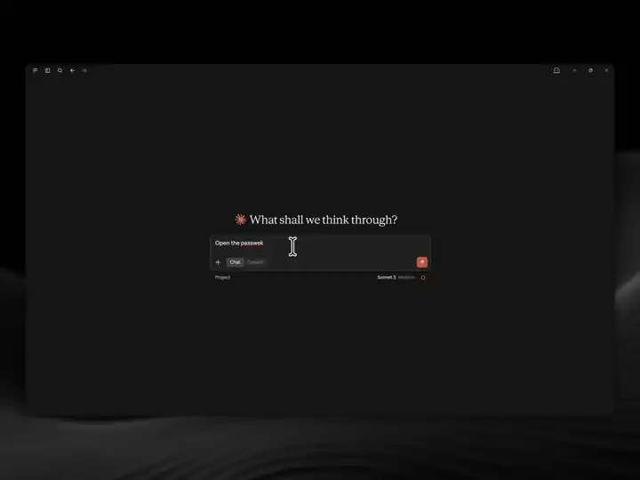

# Passwerk
**Offline EU Battery Passport Compiler.**


Drop in a supplier's messy documents (BOMs, Excel exports, energy bills, supplier
declarations). Get back a conformant Digital Battery Passport in the official AAS format
(IDTA 02035-1 to -7) plus a legally cited gap report of what is still missing.

100 % offline. Zero API keys. Agent-agnostic: an MCP server for Claude Desktop, Claude Code,
Codex, Cursor and OpenCode, a scriptable CLI, a plain TypeScript library, and a client-side
web app with QR preview.



*Claude Desktop with the `.mcpb` bundle: the model ingests the Musterwerk documents, maps and validates, then opens the workbench inside the chat. [Full-resolution MP4](https://github.com/ShahriarBijoy/passwerk/releases/download/v0.1.1/passwerk-demo.mp4), 71 seconds.*

## Quick start

**Let your agent install it.** Paste this into Claude Code, Codex, Cursor, OpenCode or any
other coding agent. It checks Node, picks the right commands for its host, installs passwerk
and tells you how to check that it works:

```
Install passwerk for me by following
https://raw.githubusercontent.com/ShahriarBijoy/passwerk/main/docs/install/agent.md
```

**Or run the commands yourself** (Node >= 22.13):

| Host | Skill and tools (plugin) | Tools only |
|---|---|---|
| Claude Code | `claude plugin marketplace add ShahriarBijoy/passwerk`<br>`claude plugin install passwerk@passwerk` | `claude mcp add passwerk --scope user -- npx -y @passwerk/server` |
| Codex | `codex plugin marketplace add ShahriarBijoy/passwerk`<br>`codex plugin add passwerk@passwerk` | `codex mcp add passwerk -- npx -y @passwerk/server` |

Start a new session afterwards, then ask the agent to call `list_capabilities`.

**Claude Desktop:** download `passwerk-<version>.mcpb` from the
[releases page](https://github.com/ShahriarBijoy/passwerk/releases) and open it. Claude Desktop
installs the server, asks for your document folder, and the twelve passwerk tools are ready
after a restart. Details in [docs/install/claude-desktop.md](docs/install/claude-desktop.md).

**Everything else:**

```sh
npx -y @passwerk/server            # MCP server over stdio, offline, no keys
npx -y @passwerk/cli audit passport.draft.json
docker run -e PASSWERK_AUTH_TOKEN=$(openssl rand -hex 32) -p 127.0.0.1:3777:3777 ghcr.io/shahriarbijoy/passwerk
```

Host snippets for Codex, Cursor, OpenCode and plain HTTP are in [docs/install](docs/install).
The agent workflow (ingest, map, validate, fix, emit) is taught by the bundled skill in
[skills/passwerk](skills/passwerk/SKILL.md).

## Why

Regulation (EU) 2023/1542, Art. 77: from **18 February 2027** every EV, light-means-of-transport
and industrial >2 kWh battery placed on the EU market needs a Digital Battery Passport. The
passport is roughly 90 data points scattered across a supplier's ERP, spreadsheets and PDFs.
Every commercial platform sells to OEMs and Tier-1s. passwerk is the on-ramp for the Tier-2
and Mittelstand supplier who receives the data request and has no tooling to answer it.

Conformance is measured, not asserted. Every emitted golden passport is replayed through the
official `aas-test-engines` oracle on every CI run ([docs/CONFORMANCE.md](docs/CONFORMANCE.md));
the badge reports verdict parity with that oracle, expected failures included. Mapping quality
on unseen supplier documents is scored in [docs/EVALUATION.md](docs/EVALUATION.md). A
sovereignty test and a `--network none` Docker job prove zero network calls. None of this is a
certification of battery-passport compliance; the template (L3) and plausibility (L4) checks
are passwerk's own.

## Packages

| Package | Role |
|---|---|
| `@passwerk/rules` | Bundled, checksummed IDTA 02035 templates, AAS schemas, EC data-point matrix, attribute knowledge base (DE/EN), legal timeline |
| `@passwerk/core` | MCP-free library: ingest (PDF, XLSX, DOCX, CSV, TXT), extract, map, validate (4 layers), gap report, emit AAS JSON / AASX / HTML, data carrier (UID, GS1 Digital Link, QR) |
| `@passwerk/server` | MCP server over stdio and Streamable HTTP: twelve tools, reference resources, workflow prompts, and the workbench as an MCP App |
| `@passwerk/cli` | `passwerk audit \| extract \| emit \| gaps \| obligations \| carrier \| tools \| chat` with CI-friendly exit codes ([reference](skills/passwerk/references/cli.md)) |
| `@passwerk/web` | Client-side web app: project, documents, facts, review, gaps, export |
| `@passwerk/mcp-app` | The same workbench inside Claude Desktop's iframe, opened by `review_passport` |

`rules`, `core`, `server` and `cli` make no network call and no model call, ever. The two
exceptions are opt-in and bring-your-own-key: the web app's mapping assist, which only ever
sees labels and values and only ever names attributes, and the `passwerk chat` demo loop.
Point the assist at `http://localhost:11434/v1` and it runs against Ollama without a byte
leaving the building.

## Command line

The CLI runs the same tools as the MCP server, in-process and offline, with exit codes a CI
job can gate on (`audit`: 0 valid, 1 warnings, 2 invalid; `gaps`: 0 when no required data
point is open).

```sh
passwerk obligations --type EV --role manufacturer --placed-on-market 2027-06-01
passwerk extract ./supplier-docs --category EV --out facts.json
passwerk audit passport.draft.json
passwerk gaps passport.draft.json --lang de
passwerk emit passport.draft.json --out ./passport
passwerk carrier passport.draft.json --out passport.qr.svg
```

## Web app

`apps/web` runs the whole pipeline in the browser as six steps: project, documents, facts,
review, gaps and export. Documents never leave the browser; the autosave keeps your decisions,
facts and proposals in IndexedDB, never the uploaded files. Inside Claude Desktop the same
workbench runs as a fixed-height instrument in the host's iframe.

```sh
pnpm install && pnpm build
pnpm --filter @passwerk/web dev
```

## Development

Requires Node 22.13 or newer and pnpm 10.

```sh
pnpm install
pnpm check      # lint + typecheck + test
pnpm build
pnpm oracle     # replay golden passports through aas-test-engines (needs uv)
```

Contributor instructions for humans and coding agents live in `AGENTS.md`. Architecture and
scope are in `docs/BUILD_PLAN.md`, every non-obvious choice in `docs/DECISIONS.md`.

## Security and privacy

`PRIVACY.md` says what passwerk sends and stores, with the tests that enforce it: nothing
leaves the machine unless you switch on one of the two optional model features. `SECURITY.md`
says how to report a vulnerability privately and where the trust boundaries are, the document
parsers first.

## Not legal advice

passwerk cites the regulation and the standards it implements, but it is a tool, not a
lawyer. Every legal claim it emits carries its sources and an `isNotLegalAdvice: true` flag.

## License

Apache-2.0. See `LICENSE` and `NOTICE`. Bundled third-party artefacts are documented with
their sources, versions, checksums and licences in `packages/rules/PROVENANCE.md`.
