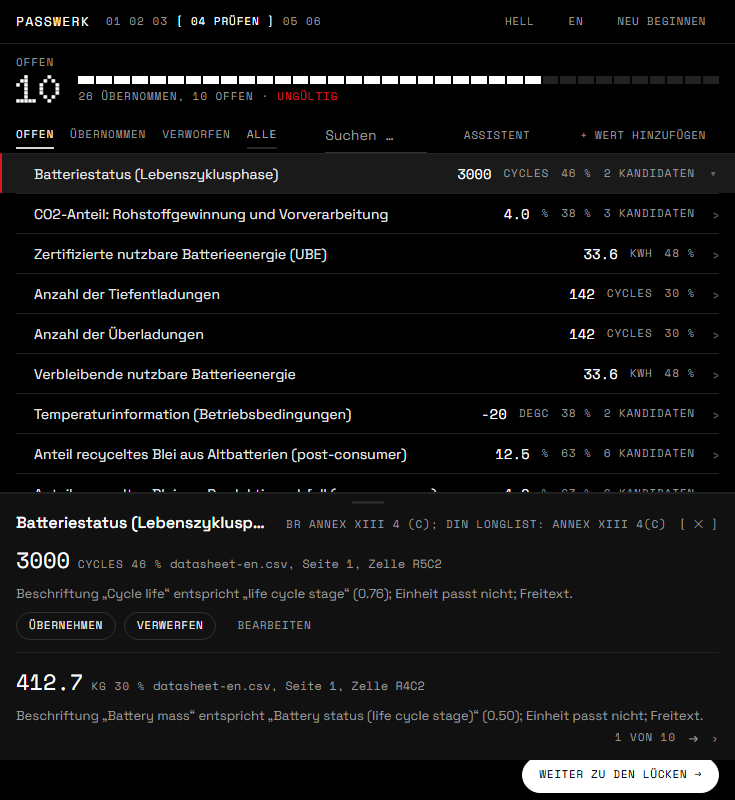
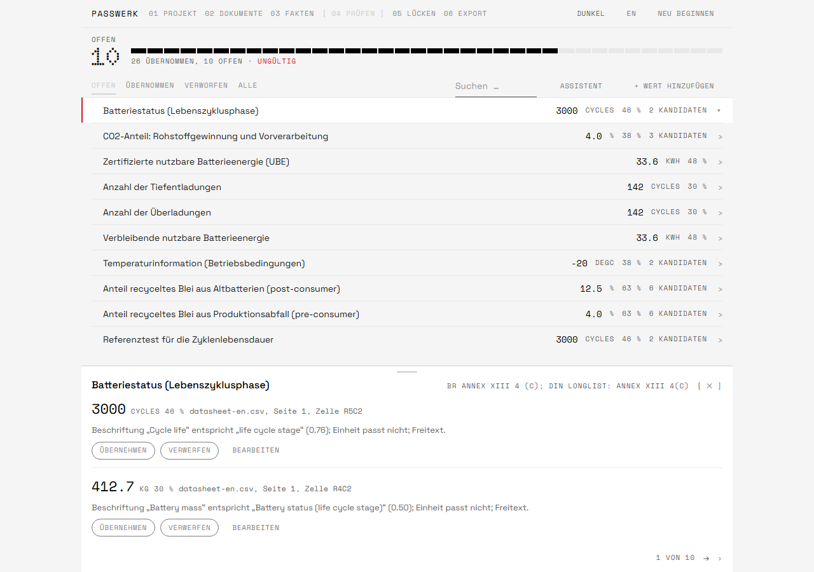

# Passwerk
**Offline EU Battery Passport Compiler.**


**The sovereign EU Battery Passport toolkit for AI agents.**

Drop in a supplier's messy documents (BOMs, Excel exports, energy bills, supplier
declarations). Get back a conformant Digital Battery Passport in the official AAS format
(IDTA 02035-1 to -7) plus a legally cited gap report of what is still missing.

100 % offline. Zero API keys. Agent-agnostic: an MCP server for Claude Code, Codex, OpenCode,
Cursor and Claude Desktop, a scriptable CLI, a plain TypeScript library, and a client-side
web app with QR preview.

## Quick start

**Claude Desktop:** download `passwerk-<version>.mcpb` from the
[GitHub releases page](https://github.com/ShahriarBijoy/passwerk/releases) and open it. Claude
Desktop installs the server, asks for your document folder, and the twelve passwerk tools are
ready after a restart; see [docs/install/claude-desktop.md](docs/install/claude-desktop.md). (No
release carries a `.mcpb` yet — this ships from the next tag; until then, build it yourself with
`pnpm package:mcpb` from a checkout.)

```sh
npx -y @passwerk/server            # MCP server over stdio, offline, no keys
claude mcp add passwerk -- npx -y @passwerk/server
npx -y @passwerk/cli audit passport.draft.json
docker run -e PASSWERK_AUTH_TOKEN=$(openssl rand -hex 32) -p 127.0.0.1:3777:3777 ghcr.io/shahriarbijoy/passwerk
```

Host snippets for Claude Desktop, Codex, Cursor and OpenCode are in
[docs/install](docs/install/claude-code.md). Packages publish to npm and the server registers
with the Official MCP Registry as `io.github.shahriarbijoy/passwerk` from tagged releases; see
[docs/RELEASE.md](docs/RELEASE.md) for the current publish status.

## Why

Regulation (EU) 2023/1542, Art. 77: from **18 February 2027** every EV, light-means-of-transport
and industrial >2 kWh battery placed on the EU market needs a Digital Battery Passport. The
passport is roughly 90 data points scattered across a supplier's ERP, spreadsheets and PDFs.
Every commercial platform sells to OEMs and Tier-1s. passwerk is the on-ramp for the Tier-2
and Mittelstand supplier who receives the data request and has no tooling to answer it.

Every emitted golden passport is replayed through the official `aas-test-engines` oracle in
CI, which checks the AAS 3.0 metamodel (passwerk's L2). The badge reports verdict parity with
that oracle, expected failures included. It is not a certification of battery-passport
compliance; template (L3) and plausibility (L4) checks are passwerk's own. A sovereignty test
proves zero network calls.

`@passwerk/rules`, `@passwerk/core`, `@passwerk/server` and `@passwerk/cli` make no network call
and no model call, ever; that is what the sovereignty tests and the `--network none` Docker job
enforce. The one exception in the whole project is opt-in and lives in the browser: the web app's
**mapping assist** (ADR D-038) can ask a model of your choice which attribute an unrecognised
label belongs to. It is off until you enter a key, it only ever receives labels and values — no
file names, no pages, no cells, no documents — and it names attributes only: values and sources
always come from your documents. Point it at `http://localhost:11434/v1` and it runs against
Ollama without a byte leaving the building.

## Status

**Phases 0 to 7 are done.**
`@passwerk/rules` (artefacts and knowledge base, now with 24 plausibility rules as reviewable
JSON) and `@passwerk/core` (model, AAS JSON and AASX emitters for all seven IDTA 02035 parts,
validation L1 to L4, readers for PDF, XLSX, CSV, DOCX and TXT, fact extraction,
confidence-scored mapping suggestions, a gap report with legal references and who-has-it per
attribute, an obligations decision tree, and DE/EN explanations for every attribute and rule)
are implemented. Every emitted golden passport is replayed through the official
`aas-test-engines` on every CI run with 16/16 L2 verdict parity, four of them expected failures
both sides reject (`docs/CONFORMANCE.md`), and a
sovereignty test plus a `--network none` Docker job prove zero network calls. Mapping quality on
unseen supplier documents is measured, not asserted: `docs/EVALUATION.md` scores the pipeline on
six documents transcribed from public datasheets (recall, precision and correction effort next to
the authored-fixture gate). `apps/web` runs the same pipeline in the browser as a first slice of
Phase 7a (upload, review, gaps, export; ADR D-029). Phase 6 added the MCP server, the agent skill
and the `passwerk` command line. Phase 7 added the data carrier (UID, GS1 Digital Link, QR SVG
and PNG), the self-contained HTML passport sheet, a publishable build (`npx -y @passwerk/server`
runs the bundled AAS SDK from a clean install), the Docker image and the Official MCP Registry
entry (`io.github.shahriarbijoy/passwerk`; see `docs/RELEASE.md` for the publish status). Phase 7a
completed the web app (project screen, facts screen, row editor, QR preview) and Phase 7b added
the MCP App: the same workbench rendered inside Claude Desktop and Claude web through
`review_passport` (ADR D-037). Next: bring-your-own-key for the web app, then Phase 7c
(packaging). See `docs/BUILD_PLAN.md` and `docs/DECISIONS.md`.

## Packages

| Package | Role |
|---|---|
| `@passwerk/rules` | Bundled, checksummed IDTA 02035 templates, AAS schemas, EC data-point matrix, attribute knowledge base (DE/EN), legal timeline |
| `@passwerk/core` | MCP-free library: ingest, extract, map, validate (4 layers), gap report, emit AAS JSON / AASX / HTML, data carrier (UID, GS1 Digital Link, QR) |
| `@passwerk/server` | MCP server over stdio and Streamable HTTP: twelve tools, reference resources, workflow prompts; see [docs/install](docs/install/claude-code.md) and [skills/passwerk](skills/passwerk/SKILL.md) |
| `@passwerk/cli` | `passwerk audit \| extract \| emit \| gaps \| obligations \| tools \| chat` with CI-friendly exit codes; see [the CLI reference](skills/passwerk/references/cli.md) |
| `@passwerk/web` | Client-side web app: upload, review, gaps, export; the primary product (ADR D-019) |
| `@passwerk/mcp-app` | The web app's workflow as an MCP App: served by the server as `ui://passwerk/workbench.html`, opened by `review_passport` in Claude Desktop and Claude web; documents stay in the iframe, the draft id stays in sync with the model (ADR D-037) |

## Command line

`@passwerk/cli` runs the same tools as the MCP server, in-process and offline, with exit codes
a CI job can gate on (`audit`: 0 valid, 1 warnings, 2 invalid; `gaps`: 0 when no required
data point is open).

```sh
pnpm build
node packages/cli/dist/bin.js obligations --type EV --role manufacturer --placed-on-market 2027-06-01
node packages/cli/dist/bin.js extract ./supplier-docs --category EV --out facts.json
node packages/cli/dist/bin.js audit passport.draft.json
node packages/cli/dist/bin.js gaps passport.draft.json --lang de
node packages/cli/dist/bin.js emit passport.draft.json --out ./passport
node packages/cli/dist/bin.js carrier passport.draft.json --out passport.qr.svg
```

`passwerk chat -m "…"` is the optional demo agent loop; it is the only command that calls a
model and needs `ANTHROPIC_API_KEY`. `packages/cli/scripts/demo.sh` (or `demo.ps1`) runs the
whole Phase 6 definition of done. The full command table is in
[skills/passwerk/references/cli.md](skills/passwerk/references/cli.md).

## Development

Requires Node 22.13 or newer and pnpm 10.

```sh
pnpm install
pnpm check      # lint + typecheck + test
pnpm build
pnpm oracle     # replay golden passports through aas-test-engines (needs uv)
```

Contributor instructions for humans and coding agents live in `AGENTS.md` and `CLAUDE.md`.

## Web app

`apps/web` is a client-side Vite app that runs the same ingest, mapping, validation and gap
report pipeline as `@passwerk/core` in the browser, as six steps: project, documents, facts,
review, gaps and export. Upload supplier documents, review the proposed mappings, see the gap
report and export the passport. Documents never leave the browser, and the autosave to
IndexedDB keeps your decisions, the extracted facts and the proposals, but never the uploaded
files. Inside Claude Desktop the same workbench (`apps/mcp-app`) runs as a fixed-height
instrument in the host's iframe rather than a scrolling document (ADR D-040).




```sh
pnpm install
pnpm build
pnpm --filter @passwerk/web dev
```

## Not legal advice

passwerk cites the regulation and the standards it implements, but it is a tool, not a
lawyer. Every legal claim it emits carries its sources and an `isNotLegalAdvice: true` flag.

## License

Apache-2.0. See `LICENSE` and `NOTICE`. Bundled third-party artefacts are documented with
their sources, versions, checksums and licences in `packages/rules/PROVENANCE.md`.
